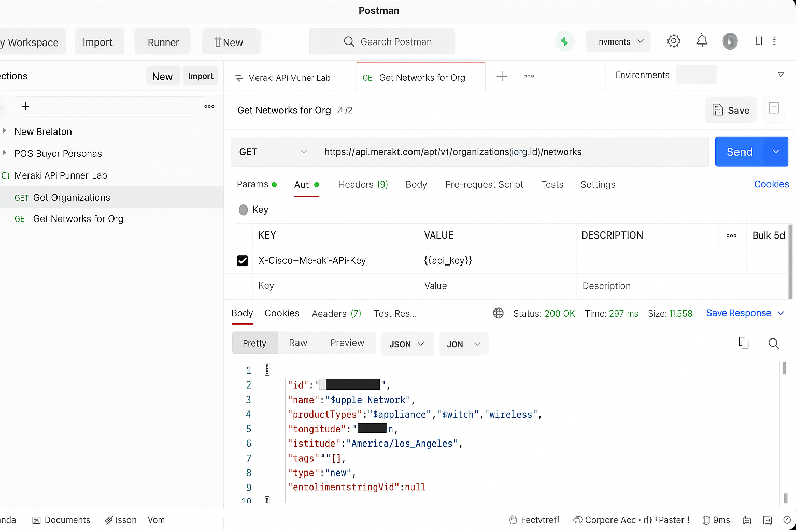

# 🔴 Lab 9: Postman Collection Runner with Chained Requests

1. Create a GET request for `organizations`, store `org_id`:
```js
let jsonData = pm.response.json();
pm.collectionVariables.set("org_id", jsonData[0].id);
```

2. Use `{{org_id}}` in the second request:
`https://api.meraki.com/api/v1/organizations/{{org_id}}/networks`

3. Run in Collection Runner.


