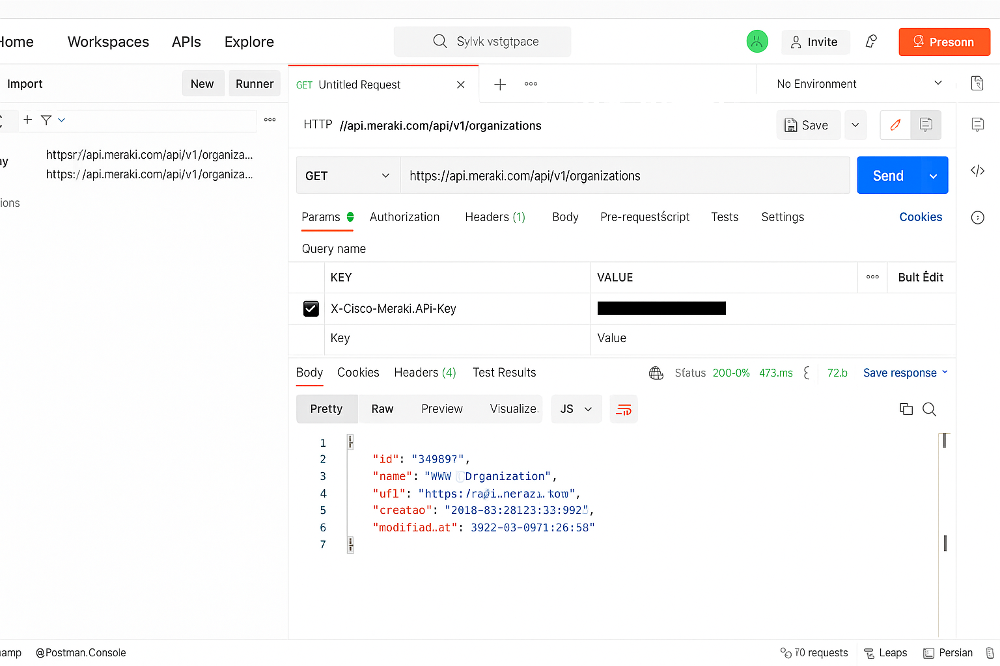

# 🔹 Lab 1: Intro to Meraki API Using Postman

## 🎯 Objective:
Use Postman to interact with Cisco Meraki API.

### Steps:
1. Open Postman
2. Create new GET request to `https://api.meraki.com/api/v1/organizations`
3. Add header: `X-Cisco-Meraki-API-Key: <your_api_key>`
4. Click Send

